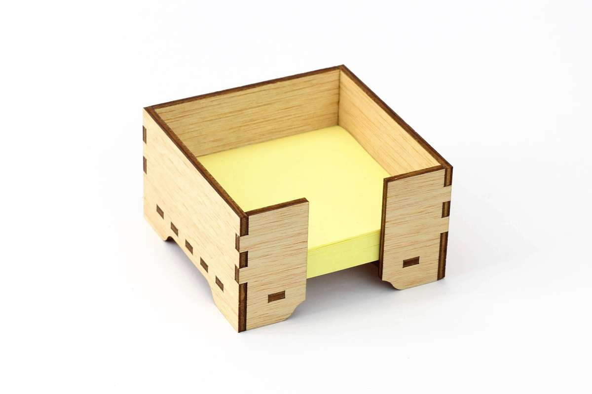
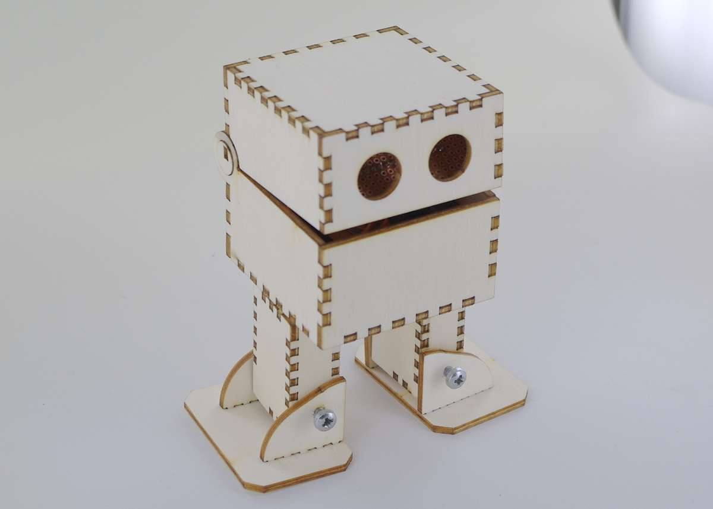
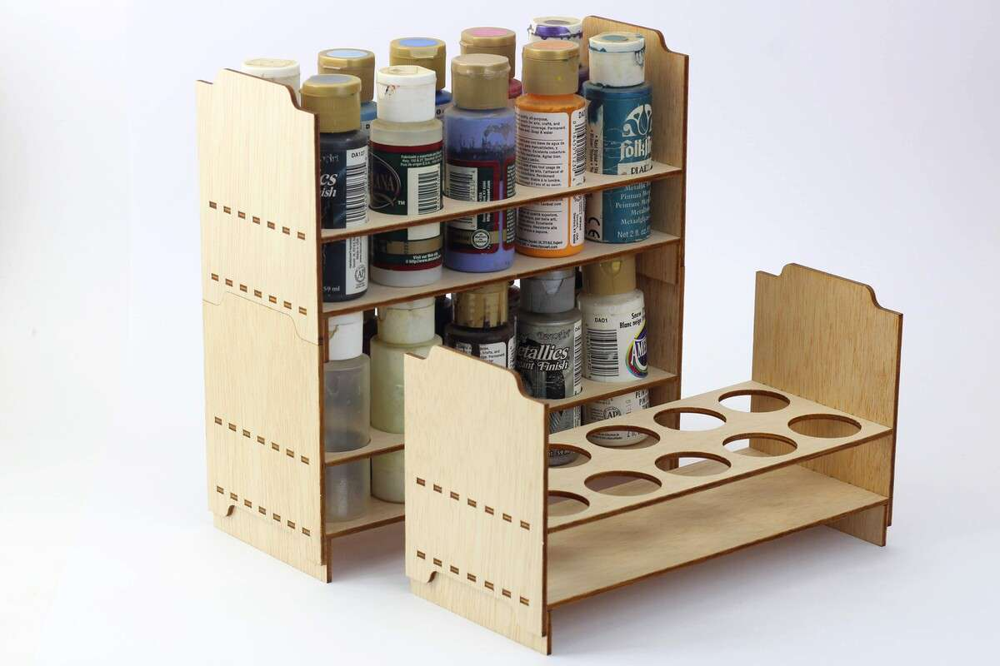
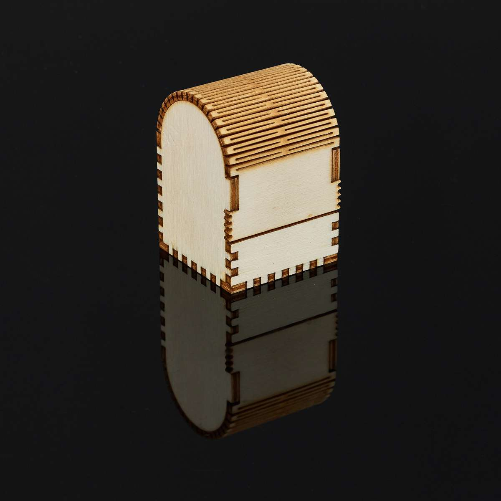
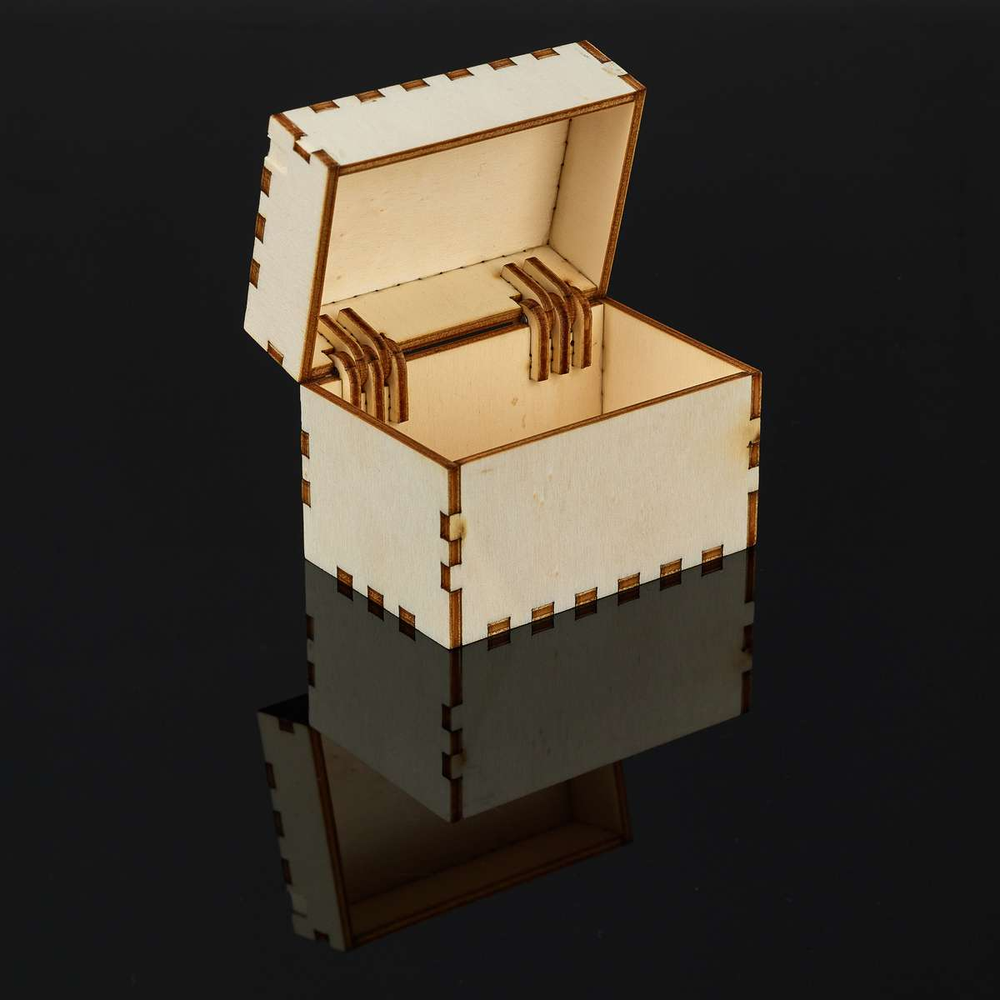
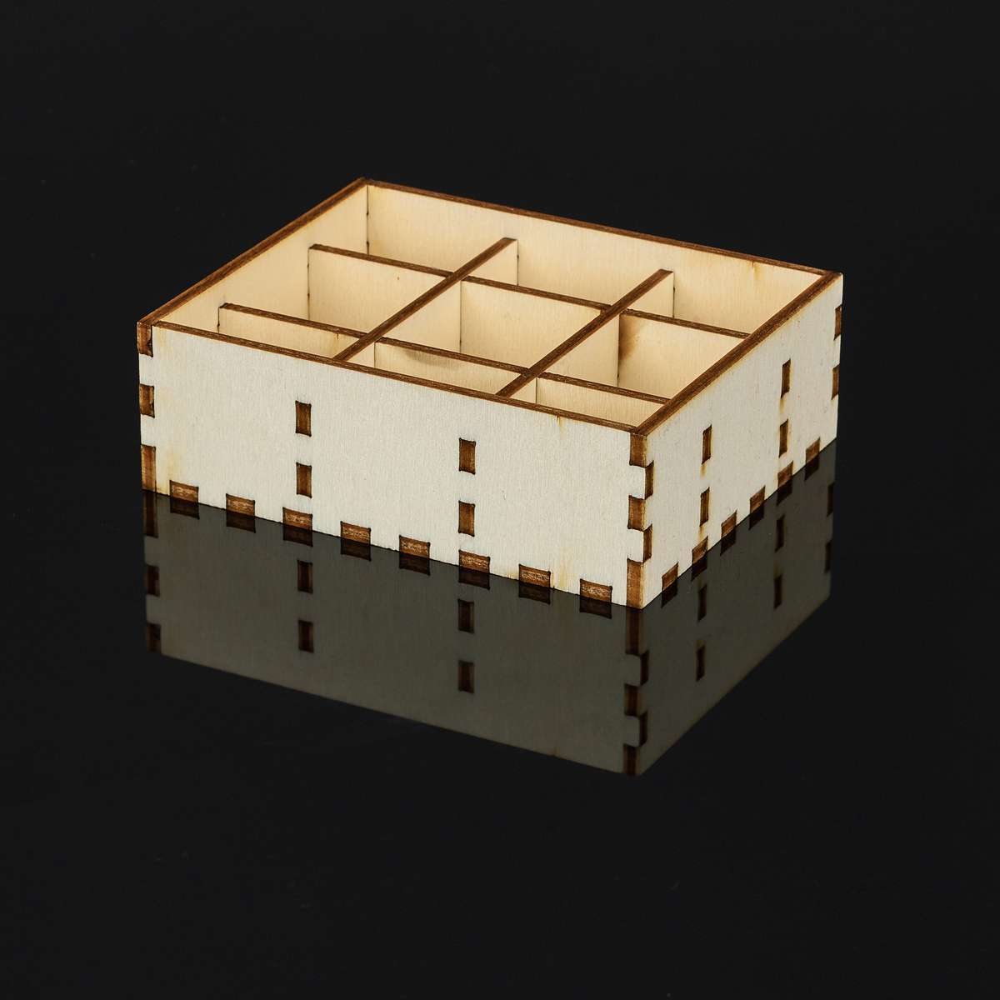
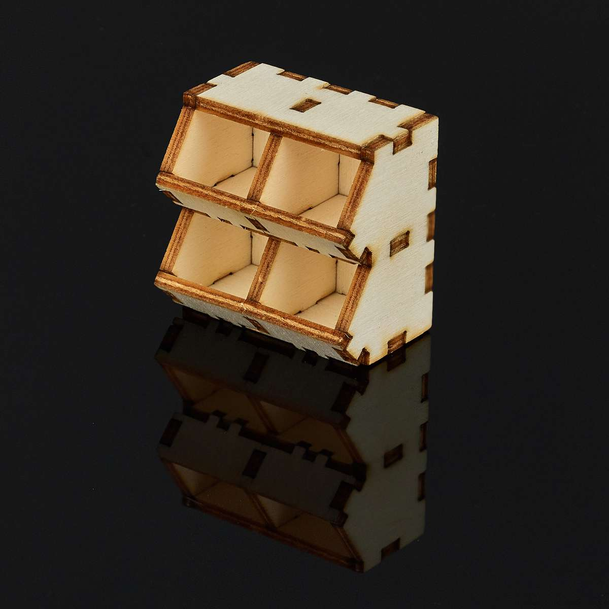
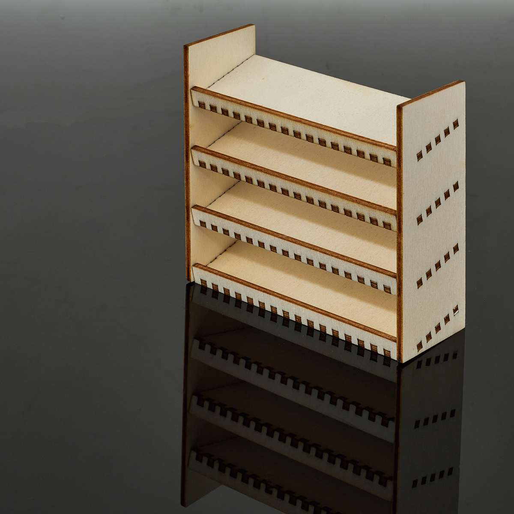
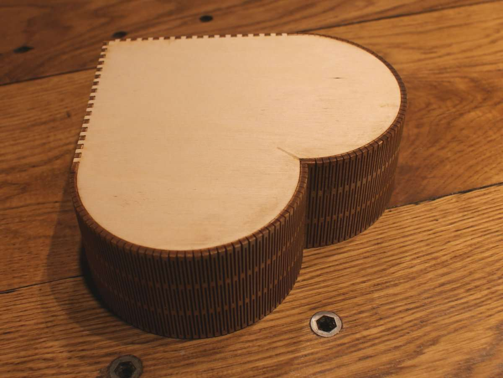

About Boxes.py
==============

.. image:: static/samples/ShutterBox.jpg
   :width: 20%

* Boxes.py is an online box generator

  * https://www.festi.info/boxes.py/index.html

* Boxes.py is an Inkscape plug-in
* Boxes.py is library to write your own
* Boxes.py is free software licensed under GPL v3+
* Boxes.py is written in Python and runs with Python 3

Boxes.py comes with a growing set of ready-to-use, fully parametrized
generators. See https://florianfesti.github.io/boxes/html/generators.html for the full list.

Features
--------

Boxes.py generates SVG images that can be viewed directly in a web browser but also
postscript and - with pstoedit as external helper - other vector formats
including dxf, plt (aka hpgl) and gcode.

Of course the library and the generators allow selecting the "thickness"
of the material used and automatically adjusts lengths and width of
joining fingers and other elements.

The "burn" parameter compensates for the material removed by the laser. This
allows fine tuning the gaps between joins up to the point where plywood
can be press fitted even without any glue.

Finger Joints are the work horse of the library. They allow 90° edges
and T connections. Their size is scaled up with the material
"thickness" to maintain the same appearance. The library also allows
putting holes and slots for screws (bed bolts) into finger joints,
although this is currently not supported for the included generators.

Dovetail joints can be used to join pieces in the same plane.

Flex cuts allows bending and stretching the material in one direction. This
is used for rounded edges and living hinges.

Documentation
-------------

Boxes.py comes with Sphinx based documentation for usage, installation
and development.

The rendered version can be viewed at <https://florianfesti.github.io/boxes/html/index.html>.
