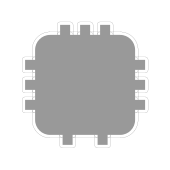
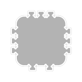

Burn correction
===============

The burn correction -- aka kerf -- is integrated into the low level
commands of Boxes.py. So for the most part developer do not need to
care about it. Nevertheless they need to understand how it works to
catch the places the do need to care.

Burn correction is done by increasing the radius of all outer
corners. This moves all the straight lines outward by the same
amount. This has the added benefit of not needing to change the length
of the straight lines -- making them independent of the adjacent
angles. An issue arises when it comes to inner corners. If they do
have a radius reducing it by the burn value does the right thing. But
for small radii and sharp corners (radius zero) this results in a
negative values. It turns out flipping over the arc for negative radii
allows keeping the lengths of the straight lines unchanged. So this is
what Boxes.py does:

This results in the straight lines touching the piece. This leads to
overcuts. They are not as nice as proper dog bones as might be used by
a dedicated CAM software. But as Boxes.py is meant to be used for laser
cutting this is deemed acceptable:

Programmer's perspective
------------------------

For this to work it is important that outside is drawn in a counter
clock wise direction while holes are drawn in a clock wise direction. 

:py:meth:`boxes.Boxes.corner` adjusts the radius automatically
according to **.burn**. This propagates to higher level
functions. Parts shipped with Boxes.py do take the
burn out-set into account and execute callbacks at the correct position.

In case developers move to a feature inside of a part or executing
callbacks while implementing a part they need to be aware of the burn
correction. :py:meth:`boxes.Boxes.cc` does correct for the out-set if
called without an **y** parameter. But if a value is given one has to
add **self.burn** to compensate. Note that the **x** value typically
does not have to be corrected as the callbacks are executed from right
underneath the part.

A similar approach is necessary when moving to a feature drawn inside
the part without the use of callbacks. Here you typically have to
correct for the out-set at the outside of the part and again for in-set
of the hole one is about to cut. This can be done in **x** or **y**
direction depending on whether the cut ist started vertical or
horizontally.
