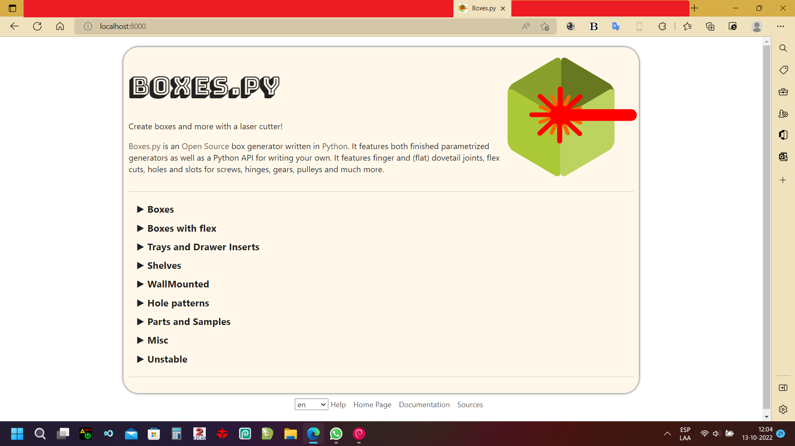

Windows
=======

Getting the Inkscape plugins to run will likely need manual
installation (see above). Note that Inkscape may come with its own
Python. If you run into trouble or have better installation
instructions please open a ticket on GitHub.

Native
------

Following steps are known to work under Windows 10 (64-bit):

1.  Go to https://www.python.org/downloads/windows/
    and download the "Windows x86-64 executable installer" for Python 3.7

    .. figure:: windows_browser_download_python.png
       :scale: 50%
       :alt: Screenshot of python.org with download of Python 3.7 (64-bit)
       :align: center

2.  Install Python 3.7 and make sure to check "Add Python 3.7 to PATH"
    while doing so

    .. figure:: windows_install_python_path.png
       :scale: 50%
       :alt: Screenshot of Python 3.7 (64-bit) installer with PATH checked
       :align: center

3.  Run the command :code:`pip install Markdown affine shapely`
    (Note: If the command pip is not found, you probably forgot to add the
    Python installation to the PATH environment variable in step 2)
	       
4.  Download Boxes.py as ZIP archive from GitHub

    .. figure:: windows_browser_download_boxespy.png
       :scale: 50%
       :alt: Screenshot of download from Boxes.py project on GitHub
       :align: center

5.  Extract the ZIP archive
    (e.g. via the built-in Windows feature or other tools like 7-Zip)

    .. figure:: windows_boxespy_zip_extract.png
       :scale: 50%
       :alt: Screenshot of Windows tools to extract the ZIP archive
       :align: center

6. Change into the folder for Boxes.py,
    e.g. with the command :code:`cd \Users\[USERNAME]\Downloads\boxes-master`
7. Run the development server with the command
    :code:`python scripts\boxesserver`
    Note: You likely will be notified by your firewall that it blocked network
    access. If you want to use boxesserver you need to allow connections.

    .. figure:: windows_cmd_python_boxesserver_firewall.png
       :scale: 50%
       :alt: Screenshot of command for running boxesserver and firewall notice
       :align: center

8. Open the address http://localhost:8000/ in your browser and have fun :)

    .. figure:: windows_browser_boxespy.png
       :scale: 50%
       :alt: Screenshot of a browser window running Boxes.py locally
       :align: center

Additionally the command line version of Boxes.py can be used with
the command :code:`python scripts\boxes`.

Windows Subsystem for Linux
---------------------------

Another way of installing Boxes.py on Windows is to use the Windows Subsystem
for Linux (WSL). This requires newer versions of Windows 10. Once it is
installed (e.g. via the Ubuntu App from the Microsoft Store), the installation
is identical to the installation on Linux systems.

Once wsl is installed, run it and enter the following commands:

- :code:`cd ~`
- :code:`git clone https://github.com/florianfesti/boxes.git`
- :code:`cd ~/boxes`
- :code:`python3 -m pip install -r ~/boxes/requirements.txt`
- :code:`python3 ~/boxes/scripts/boxesserver`

